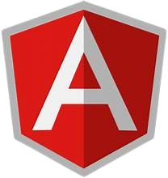

[
<h1 align="center">Hi 👋, I'm DANIEL GIATHI</h1>
<h3 align="center">A passionate frontend developer from KENYA</h3>
<!--  -->

## My favorite tools and technologies ⚙️

> Tools and technologies that I have worked with and am interested in

<table>
  <tr>
    <td align="center" width="96">
        
       C#
    </td>
    <td align="center" width="96">
      
       Python
    </td>
    <td align="center" width="96">
        
       Javascript
    </td>
    <td align="center" width="96">
        
       C++
    </td>
       <td align="center" width="96">
        
       Django
    </td>
       <td align="center" width="96">
        
       Github
    </td>
          <td align="center" width="96">
        
       Rest API
    </td>
          <td align="center" width="96">
        
       Docker
    </td>
    <td align="center" width="96">
        
       Nginx
    </td>
  </tr>
  <tr>
    <td align="center" width="96">
        
       Git
    </td>
    <td align="center"  width="96">
        
       GitLab
    </td>
    <td align="center"  width="96">
        
       HTML
    </td>
    <td align="center" width="96">
        
       CSS
    </td>
    <td align="center"  width="96">
        
       Bootstrap
    </td>
    <td align="center" width="96">
        
       Tailwind
    </td>
        <td align="center" width="96">
        
       JQuery
    </td>
        <td align="center" width="96">
        
       PostgreSQL
    </td>
            <td align="center" width="96">
        
       ASP.NET
    </td>
  </tr>
   <tr>
    <td align="center" width="96">
        
       Redis
    </td>
        <td align="center" width="96">
        
       Postman
    </td>
            <td align="center" width="96">
        
       Linux
    </td>
    <td align="center" width="96">
        
       Dart
    </td>
    <td align="center" width="96">
        
       RabbitMQ
    </td>
    <td align="center" width="96">
        
       sentry
    </td>
    <td align="center" width="96">
        
       Celery
    </td>
    <td align="center" width="96">
        
       Docusaurus
    </td>
    <td align="center" width="96">
        
       Pytest
    </td>
  </tr>
 <tr>
 </tr>
</table>

- 📫 How to reach me **giathidaniel252@gmail.com**

## 🌐 Connect with me:

 

<h3 align="left">Languages and Tools:</h3>

                 

 

